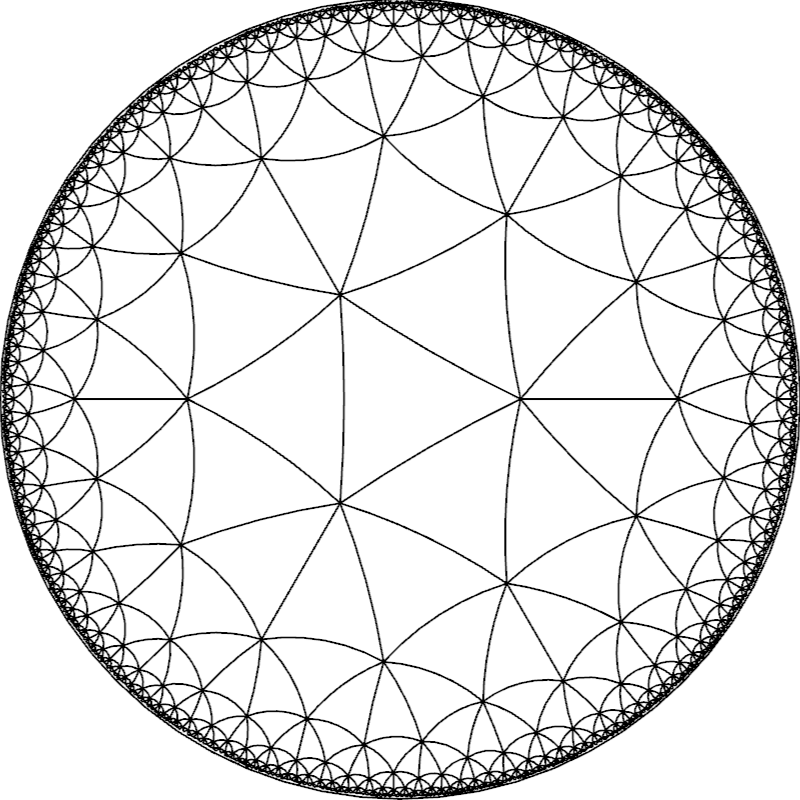
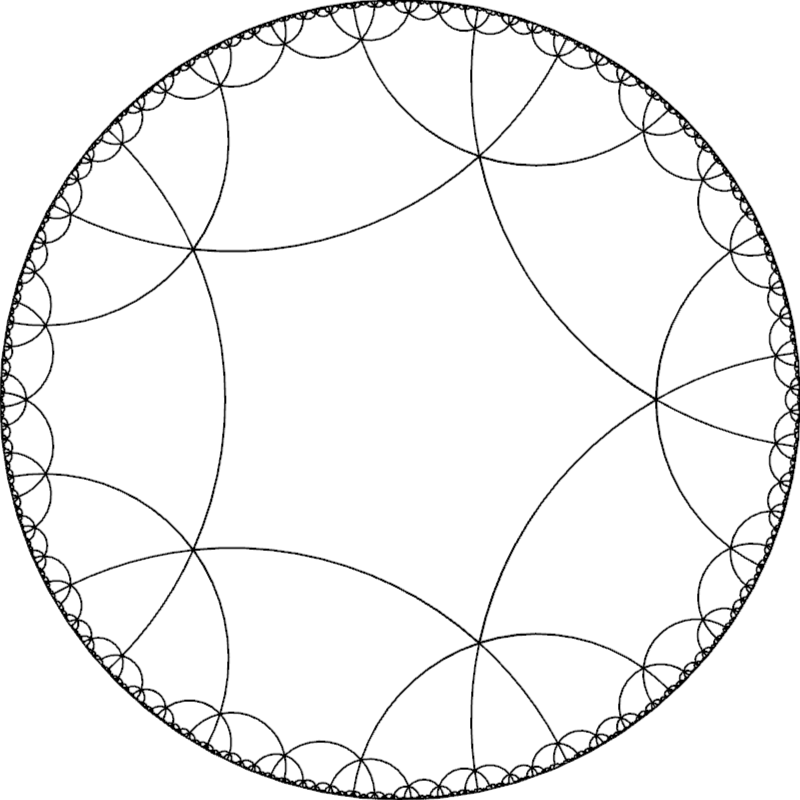

### Librairie permettant le calcul de pavages hyperboliques, écrite en Rust avec l'aide du toolkit Nannou, dans le cadre de notre travail de maturité.



## Compiler et exécuter les exemples
Dans le dossier [examples/](examples/) vous trouverez le code de programmes utilisant notre librairie. Afin d'exécuter un programme d'exemple, il faudra entrer les commandes suivantes dans un terminal en veillant à remplacer par les valeurs appropriées. L'exemple d'application aboutie a pour nom "hello"
```sh
cd chemin/du/dossier/racine
cargo run --release --example nom_de_l_exemple_sans_extension
```
## Utilisation de la librairie
### Calcul d'un pavage
```rust
let p = 4;
let q = 5;
let max_depth = 5;
let tiling = Tiling::new(p,q,max_depth);
tiling.compute();
```
### Dessin d'un pavage sur une instance draw de Nannou
Le code suivant vous permettra de dessiner sur un canvas Nannou. Si vous ne savez pas comment créer un projet et par conséquent un canvas avec Nannou, veuillez vous référer à ces [tutoriels](https://guide.nannou.cc/tutorials)
```rust
for geodesic in tiling.geodesics().unwrap() {
        geodesic.draw(&draw);
}
```
